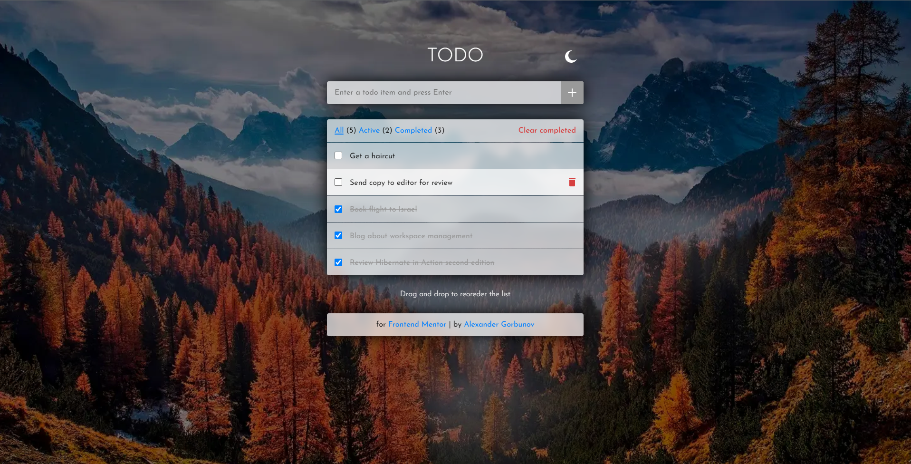
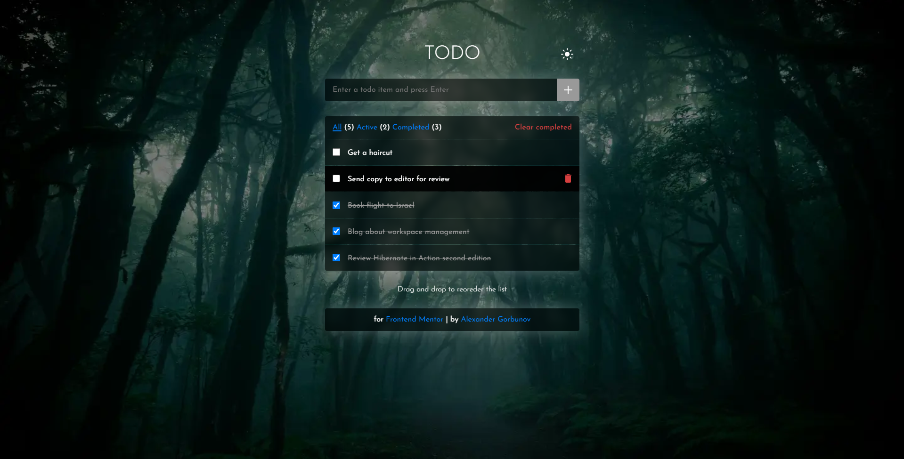
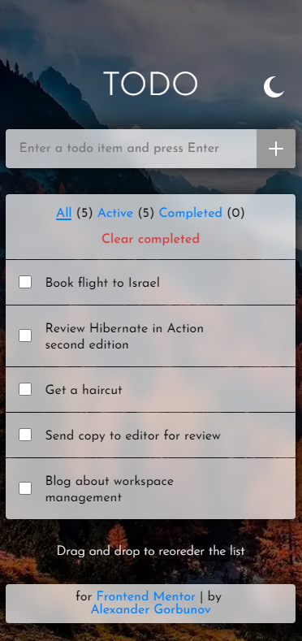
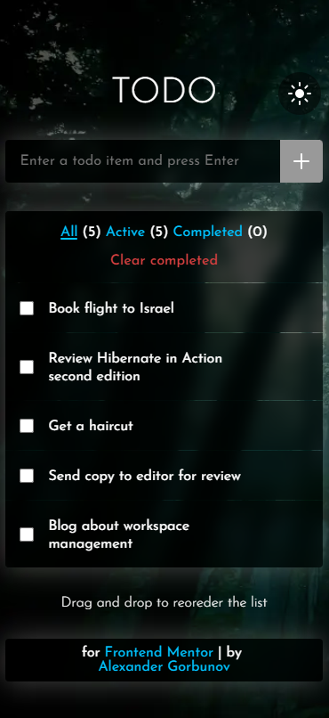

<h1 align="center">Todo App</h1>
<p align="center">
 Todo App using TypeScript, SCSS. Built with Webpack
</p>

<p align="center">
  
</p>

<p align="center">
  
</p>

<p align="center">
  
  
</p>

## ℹ️ About

This is a solution to the [Todo app challenge on Frontend Mentor](https://www.frontendmentor.io/challenges/todo-app-Su1_KokOW).

The challenge is to build out a todo list and get it looking as close to the design as possible.

See [task.md](./docs/task.md) for more details about the task.

Users should be able to:

- View the optimal layout for the app depending on their device's screen size
- See hover states for all interactive elements on the page
- Add new todos to the list
- Mark todos as complete
- Delete todos from the list
- Filter by all/active/complete todos
- Clear all completed todos
- Toggle light and dark mode
- **Bonus**: Drag and drop to reorder items on the list

## ⚙️ Tools

- **HTML5**
  - Semantic HTML
- **SASS**
  - Flexbox
  - BEM methodology
  - Responsive design
  - Desktop first
- **NodeJS**
- **TypeScript**
- **Webpack**
- **Github Pages**
  - Hosting

## 🔨 Build project

<table>
  <tr>
    <th>Command</th>
    <th>Description</th>
  </tr>
  <tr>
    <td><code>npm&nbsp;install</code></td>
    <td>Installs required npm packages. Run it before building the project</td>
  </tr>
  <tr>
    <td><code>npm&nbsp;start</code></td>
    <td>Builds application in development mode, launches a server that opens in a new browser tab</td>
  </tr>
  <tr>
    <td><code>npm&nbsp;run&nbsp;dev</code></td>
    <td>Builds application in development mode, results may be found in <code>./build</code> folder</td>
  </tr>
  <tr>
    <td><code>npm&nbsp;run&nbsp;build</code></td>
    <td>Builds application in production mode, results may be found in <code>./build</code> folder. Files are minimized, hash added to filenames to help when dealing with caching</td>
  </tr>
</table>

## 📁 File Structure

<table>
  <tr>
    <th>Path</th>
    <th>Description</th>
  </tr>
  <tr>
    <td colspan="2"></td>
  </tr>
  <tr>
    <td><code>build</code></td>
    <td>Folder with files generated by Webpack</td>
  </tr>
  <tr>
    <td><code>static</code></td>
    <td>Folder with static assets (images, favicon)</td>
  </tr>
  <tr>
    <td><code>__tests__</code></td>
    <td>Folder with Gherkin tests (manual, no automation)</td>
  </tr>
  <tr>
    <td colspan="2"></td>
  </tr>
  <tr>
    <td><code>src</code></td>
    <td>Source files needed for application development</td>
  </tr>
  <tr>
    <td><code>src / index.scss</code></td>
    <td>Main styles</td>
  </tr>
  <tr>
    <td><code>src / index.ts</code></td>
    <td>Main file with TS</td>
  </tr>
  <tr>
    <td><code>src / scripts</code></td>
    <td>Definition of TS classes</td>
  </tr>
  <tr>
    <td colspan="2"></td>
  </tr>
  <tr>
    <td><code>docs</code></td>
    <td>Folder with additional information, documentation</td>
  </tr>
  <tr>
    <td><code>docs / design</code></td>
    <td>Folder with images of how the interface must look like</td>
  </tr>
  <tr>
    <td><code>docs / results</code></td>
    <td>Folder with screenshots of how the application works after being fully developed</td>
  </tr>
  <tr>
    <td><code>docs / unused assets</code></td>
    <td>Folder with assets from initial FrontendMentor archive that I didn't use</td>
  </tr>
  <tr>
    <td><code>docs / README-template.md</code></td>
    <td>Template for README.md, don't use it (from FrontendMentor)</td>
  </tr>
  <tr>
    <td><code>docs / style-guide.md</code></td>
    <td>Style information: color palette, fonts, etc. (from FrontendMentor)</td>
  </tr>
  <tr>
    <td><code>docs / task.md</code></td>
    <td>Detailed task description (from FrontendMentor)</td>
  </tr>
  <tr>
    <td><code>docs / todo-app-main.zip</code></td>
    <td>Initial archive provided by Frontend Mentor</td>
  </tr>
  <tr>
    <td colspan="2"></td>
  </tr>
  <tr>
    <td><code>LICENSE</code></td>
    <td>MIT License</td>
  </tr>
  <tr>
    <td><code>package-lock.json</code></td>
    <td>JSON file that keeps track of the exact version of every package that is installed so that a product is 100% reproducible in the same way even if packages are updated by their maintainers</td>
  </tr>
  <tr>
    <td><code>package.json</code></td>
    <td>JSON file that holds various metadata relevant to the project. This file is used to give information to npm that allows it to identify the project as well as handle the project's dependencies</td>
  </tr>
  <tr>
    <td><code>tsconfig.json</code></td>
    <td>JSON file that holds different compiler options for TypeScript</td>
  </tr>
  <tr>
    <td><code>webpack.common.js</code></td>
    <td>Contains configuration common for build and dev configs</td>
  </tr>
  <tr>
    <td><code>webpack.dev.js</code></td>
    <td>Contains configuration for development mode</td>
  </tr>
  <tr>
    <td><code>webpack.prod.js</code></td>
    <td>Contains configuration for production mode</td>
  </tr>
  
</table>

## 📦 NPM Packages

<table>
  <tr>
    <th>Package</th>
    <th>Comment</th>
  </tr>
  <tr>
    <td><code>webpack</code></td>
    <td>Module bundler</td>
  </tr>
  <tr>
    <td><code>webpack-cli</code></td>
    <td>Required for work of webpack with v4 or later</td>
  </tr>
  <tr>
    <td><code>webpack-merge</code></td>
    <td>Helps to merge configs (webpack.common.js + webpack.dev.js for example)</td>
  </tr>
  <tr>
    <td><code>webpack-dev-server</code></td>
    <td>Launches developer server that automatically applies all changes in code</td>
  </tr>
  <tr>
    <td><code>typescript</code></td>
    <td>Is used by ts-loader, compiles ts into js</td>
  </tr>
  <tr>
    <td><code>ts-loader</code></td>
    <td>Is used by Webpack, compiles ts into js, resolves imports</td>
  </tr>
  <tr>
    <td><code>node-sass</code></td>
    <td>Is used by sass-loader, compiles sass/scss into css</td>
  </tr>
  <tr>
    <td><code>sass-loader</code></td>
    <td>Is used by Webpack, compiles sass/scss into css</td>
  </tr>
  <tr>
    <td><code>css-loader</code></td>
    <td>Is used by Webpack, resolves assets imported in css files, unites them in one file</td>
  </tr>
  <tr>
    <td><code>css&#8209minimizer&#8209webpack&#8209plugin</code></td>
    <td>Is used by Webpack, minifies css</td>
  </tr>
  <tr>
    <td><code>mini-css-extract-plugin</code></td>
    <td>Extracts transpiled css in a separate css file</td>
  </tr>
  <tr>
    <td><code>html-loader</code></td>
    <td>Is used by Webpack, resolves assets in html files. (Mode production works perfectly without it, but development mode for some reason sometimes loses some assets referred in html...)</td>
  </tr>
  <tr>
    <td><code>html&#8209webpack&#8209plugin</code></td>
    <td>Is used by Webpack, generates a html file from a template. Minifies html, adds links to js, css</td>
  </tr>
  <tr>
    <td><code>terser-webpack-plugin</code></td>
    <td>Is used by Webpack, minifies js (comes with webpack, no need to install it separately)</td>
  </tr>
  
</table>

## 💡 Details

### Working with Webpack

Yeah, baby! I configured Webpack. That's a module bundler. It took much time, comparable with the time required to code the todo list itself.

Now it takes all my ts files and compiles them into one js file. Then it minifies the js file

Also it transpiles scss files into css, resolves all imports, generates hashes for all imports, and adds styles in style tag of index.html

Also it turns my template html into index.html, adds there links to js file, resolves all relative imports to assets with hash names

Also it works differently depending on mode. In production mode it minifies everything. In development it doesn't

Also it places all built files in a build folder. And clears the results of the previous build after every build

Also now it launches the server and automatically opens it in a new tab and automatically tracks all changes in files. Just use "npm run start"

Also it took many hours of reading articles, watching videos in order to properly configure it

I'm fully satisfied

P.S. Tried to make Webpack place all generated assets (images, svg, webp) in a separate folder inside of `build`. Used `file-loader`, but it ocurred that it's outdated, works with errors. I couldn't find any alternatives, so everything is placed automatically now in one place: in `build` folder.

<hr>

### Legendary Todo list

I have finally accomplised the task, that every beginner frontend developer must complete. Todo list! With many, many features

<hr>

### What you can do with todo list

You can

- Add new items + submit validation
- Check / Uncheck items
- Delete individual items
- Delete all completed (checked) items
- Display all, active, completed items
- Drag and drop items

<hr>

### Save to local storage

Theme is saved in local storage. Initially, if there is no theme in the storage, I use the `prefers-color-scheme` to define the system theme of a user.

```ts
// If the theme is saved in local storage take it from there
const isDarkModeFromStorage = JSON.parse(localStorage.getItem("isDarkMode") ?? "null");
if (isDarkModeFromStorage) this._isDarkMode = isDarkModeFromStorage;
// Otherwise use theme from user's system settings
else
  this._isDarkMode = window.matchMedia && window.matchMedia("(prefers-color-scheme: dark)").matches;
```

I also save the todo list items and their order in local storage. Thus after page refresh data doesn't disappear.

<hr>

### Dark theme, Light theme

Users can toggle dark and light theme. The default theme is defined using `prefers-color-scheme`.

Classic CSS class toggle on/of to enable/disable dark theme.

<hr>

### Figma prototype

I use a free version of FrontendMentor. Thus I don't have access to Figma prototypes. But that's not a problem - I made my own one

Here it is: https://www.figma.com/file/4dFzGRjZoRp0v3ed84Xrci/Todo-App

That helped me to make the application look quite appealing and to experiment with elements to come up with the best looking variant

<hr>

### Gherkin syntax

I thought about including Jest to add unit test my scripts, but in this case it seems redundant. All functions are tightly related to the DOM elements and depend on their state. Thus it's extremely difficult to test this functions in isolations.

So instead I decided to add Gherkin "Given When Then" scenarios to describe the business logic. I wrote them prior to coding the implemenation. They describe how the interface must work with as few as possible interface details like "press button" and so on.

```
Feature: Switch a theme

  In order to see the theme I like
  As a User
  I want to be able to switch themes

  Scenario Outline: Switch theme
  Given Current theme is <CurrentTheme>
  When User switches a theme
  Then System shows a <NewTheme>

  Examples:
      | CurrentTheme          | NewTheme    |
      |-----------------------|-------------|
      | light theme (default) | dark theme  |
      | dark theme            | light theme |
```

<hr>

### Other notes

- Submit button is disabled when input is empty
- Hover effect on items
- Theme changing icon changes depending on the current theme
- Added nice background, minified it by converting images to webp format. From 1.5 md it went to about 50 Kb!
- The interface lags for some reason when there are more than 10 items on the screen. Don't know why it happens. Even hover animation lags! Inexplicable
- Item height adapts to the length of content, so a user may input strings of any length. Don't think there is any validation needed in this case.
- If the list is empty the block "No items to display" is shown
- Added a nice frosted ice effect from IOS
- Changed the initial design of application described in the task, using Figma

## 🔗 Useful resources

- [Webpack tutorial](https://www.youtube.com/watch?v=MpGLUVbqoYQ&ab_channel=freeCodeCamp.org) - Great tutorial about configuring Webpack!

## 👤 Author

- Frontend Mentor - [@GrbnvAlex](https://www.frontendmentor.io/profile/GrbnvAlex)
- Telegram - [@Arlagonix](https://t.me/Arlagonix)
- Github - [@arlagonix](https://github.com/arlagonix)
